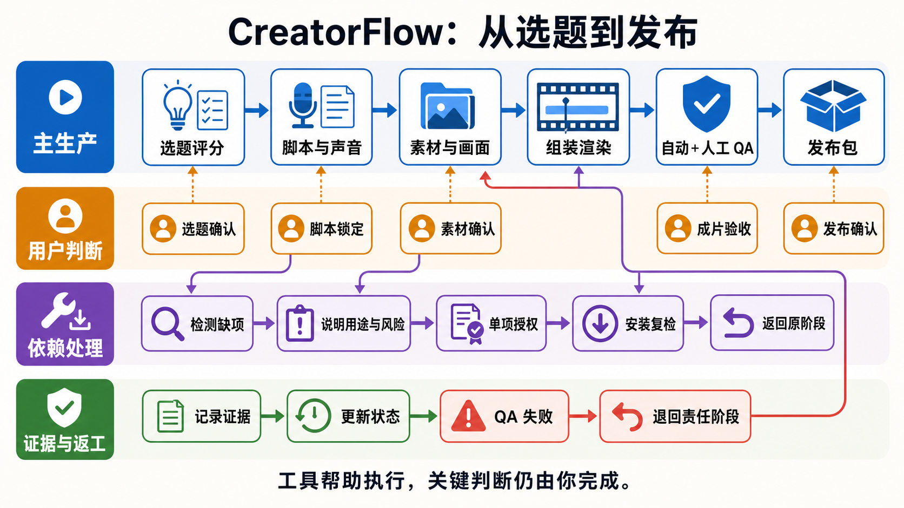

# CreatorFlow

把一个选题一路做成脚本、配音、素材、成片和发布包的 Agent Skills 工作流。

**支持平台：** Codex · TRAE Work · Claude Code · OpenClaw · Hermes

`选题 → 评分 → 脚本 → 素材 → visual plan → 组装 → 渲染 → QA → 发布包 → 收尾`

CreatorFlow 来自真实使用中的自媒体生产链路。你可以跑完整流程，也可以只调用其中一个阶段。仓库提供流程、脚本、检查规则和项目模板；账号定位、个人判断、写作风格与知识库由你自己补入。

[](docs/workflow-thread-map.md)

点击路线图可查看完整节点、阶段交付和 QA 返工规则。

V1 面向 Windows。Core 使用 PowerShell、Python、FFmpeg 和 ffprobe；HyperFrames、IndexTTS2、ASR、视频生成适配器与上传工具按需启用。

## 它会交付什么

一次完整运行会把输入和生产证据写进项目目录：

```text
你的选题与内容
  ↓
Topic              选题结论、评分、风险和证据
Script TTS         录音稿、音频、字幕与画幅决定
Material           来源候选、逐句素材表与 visual plan
Assembly           可检查的工程与候选成片
QA                 自动报告 + 绑定成片 SHA256 的人工关键帧复核
Publish Wrap Up    成片、封面、发布文案和 publish/ 发布包
```

自动 QA 通过后仍要看关键帧。CreatorFlow 不会把“脚本显示 PASS”当成“视频已经能发”。

## 最快开始

### 交给你的 Agent

克隆仓库，用具备本地文件和终端能力的 Agent 打开仓库根目录，再发送：

```text
请使用 CreatorFlow 的 zimeiti-video-workflow。先只做 Core 能力检查，把缺失项、用途、官方下载来源、准备执行的命令和风险列给我；未经我明确同意，不要下载、安装、登录或写入凭据。检查通过后，用仓库模板创建一个新视频项目，停在 Topic 阶段，告诉我需要填写哪些个人输入。
```

所有平台共用 `.agents/skills/` 中的主流程、脚本和检查规则。Claude Code 的薄入口位于 `.claude/skills/`；它只负责发现主 Skill，不复制工作流。第一次运行见[安装与第一次运行](docs/installation.md#7-在-agent-中推进六个阶段)。

### 手动开始

```powershell
git clone https://github.com/Damonhhh/creator-flow.git
cd .\creator-flow

powershell -NoProfile -ExecutionPolicy Bypass -File .\scripts\test-workflow-capabilities.ps1 -Profile Core

Copy-Item .\config\workflow.example.json .\config\workflow.local.json
Copy-Item .\config\tts.example.json .\config\tts.local.json
Copy-Item .\config\providers.example.json .\config\providers.local.json
Copy-Item .\config\publish.example.json .\config\publish.local.json

powershell -NoProfile -ExecutionPolicy Bypass -File .\scripts\new-video-project.ps1 `
  -Name '2026-08-14-my-first-video' `
  -Destination .\videos
```

只有能力检查返回 `ready: true` 才继续。完整步骤和每条命令见[安装与第一次运行](docs/installation.md)。

走到配音、素材或成片阶段时，用统一入口检查当前阶段。它默认只说明缺什么、从哪里获取、会执行什么、还有哪些后续动作，以及不安装时怎么降级：

```powershell
powershell -NoProfile -ExecutionPolicy Bypass -File .\scripts\resolve-workflow-dependencies.ps1 -Stage Material
```

下载和安装必须通过一个明确的 `-AcceptAction` 单独授权。Agent Reach、IndexTTS2 和 HyperFrames 都按需接入，不是开局一次性装完。

## 先换成你自己的内容

新项目会从 `Topic / topic_ready` 开始。先填写四个文件：

- `account-profile.md`：账号服务谁、持续讲什么、明确不讲什么。
- `writing-style.md`：语气、句式、禁用表达和真实改写样本。
- `knowledge-sources.md`：可信来源、复核规则和禁止公开的边界。
- `source-content.md`：这次要处理的选题、素材、证据与初步判断。

示例只是帮助流程启动，不会替你生成账号定位，也不包含作者的私人知识库、声音样本、账号凭据或历史内容。

## 两种用法

### 跑完整链路

```text
使用 CreatorFlow 的 zimeiti-video-workflow，从当前项目的 project-state.json 开始。按 Topic、Script TTS、Material、Assembly、QA、Publish Wrap Up 逐阶段推进；每个阶段完成后保存证据，遇到缺失依赖或需要下载、登录、配置凭据时先停下并征得我的明确同意。
```

### 只做当前阶段

```text
使用 zimeiti-video-workflow，读取 videos\2026-08-14-my-first-video\project-state.json，只完成当前阶段并保存证据。不要提前推进下一阶段，也不要把文件存在当成已经验收。
```

工作流会读取 `currentStage`、`stageStatus`、`nextAction` 和 `blockers`，再选择对应阶段。想先看懂主生产、用户判断、按需依赖和 QA 返工如何交汇，见[工作流线程图](docs/workflow-thread-map.md)；六个阶段的完整字段和门禁见[执行图](.agents/skills/zimeiti-video-workflow/references/pipeline.md)。

| 阶段 | 主要工作 | 完成证据 |
| --- | --- | --- |
| Topic | 选题、评分、否决理由 | 选题决策与证据 |
| Script TTS | 录音稿、声音、字幕、画幅 | 锁定脚本与实际音频/SRT |
| Material | 来源、素材、逐句视觉任务 | `source-candidates.md`、`material-beat-map.md` |
| Assembly | 工程组装与渲染 | 工程检查和候选成片 |
| QA | 自动检查与人工关键帧复核 | QA 报告、`human-visual-review-vNN.md` |
| Publish Wrap Up | 封面、文案、发布包与收尾 | `publish\`、状态与同步记录 |

## 仓库里的两个真实起点

- [离线选题评分示例](examples/ai-mainline-topic/README.md)：用固定候选和可见评分表生成排名、入选理由与淘汰理由，不联网，也不读取个人知识库。
- [最小视频项目模板](examples/minimal-video-project/README.md)：创建真实项目目录和初始状态，不预填 QA、人工验收或发布成功。

先试选题评分：

```powershell
powershell -NoProfile -ExecutionPolicy Bypass -File .\scripts\run-ai-daily-topic-chain.ps1 `
  -InputPath .\examples\ai-mainline-topic\candidates.example.json `
  -RubricPath .\examples\ai-mainline-topic\rubric.example.json `
  -OutputRoot .\output\ai-mainline-topic
```

它会生成 `topic-ranking.json` 和 `topic-decision.md`。仓库没有放一条伪装成真实验收结果的成片；视频、人工复核和发布包必须由你在实际项目中生成。

## 缺少依赖时

能力探测只报告，不自动安装。执行者需要先说明：缺什么、用来做什么、官方下载来源、拟执行命令，以及是否涉及第三方代码、登录或凭据。得到明确同意后才能继续。

第一次进入 Assembly 且项目还没有渲染器时，先查看初始化方案：

```powershell
powershell -NoProfile -ExecutionPolicy Bypass -File .\scripts\resolve-workflow-dependencies.ps1 `
  -Stage Assembly `
  -ProjectDir .\videos\2026-08-14-my-first-video
```

这条命令不下载内容。确认方案后，如果愿意下载，再明确加上 `-AcceptAction hyperframes`。其他依赖和可用降级路线见[依赖矩阵](docs/dependency-matrix.md)。

## 边界

- `.local.json`、个人项目文件、Cookie、Token、API Key、声音样本和本机路径不得提交。
- API Base 只从命令行、环境变量或 `providers.local.json` 读取，公开仓库不预设第三方中转地址。
- AI Hot、NewsNow 等实时发现源默认不联网。只有显式加上 `-LiveCollection`，并通过参数或环境变量提供 HTTPS 地址后，脚本才会请求对应服务。
- 默认生成可复核的发布包，不自动上传。
- 自动 QA 和 human-visual-review 是两道不同的门。
- 这套仓库负责把链路跑通，不替任何人承诺流量、账号定位或内容判断。

进一步阅读：[完整安装](docs/installation.md) · [项目契约](docs/project-contract.md) · [隐私边界](docs/privacy-boundary.md) · [故障排查](docs/troubleshooting.md)

## 发布前自检

准备 fork、改造或重新发布时，运行 Core 发布门禁：

```powershell
powershell -NoProfile -ExecutionPolicy Bypass -File .\scripts\test-public-release.ps1 -Profile Core
```

它会核对 Git 工作区、白名单文件、SHA256、隐私扫描和 Core 测试。`Full` 还需要完整渲染环境与一份已完成人工复核的真实视频项目；缺项会直接列出，不会显示成假 PASS。

## License

[MIT](LICENSE)
