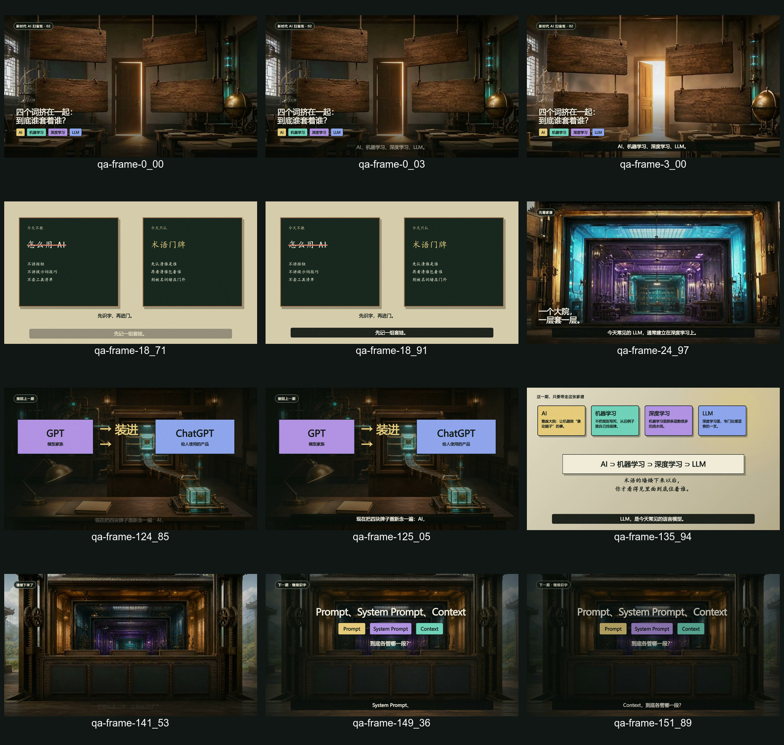

# 第一次真实运行：一条 2 分 32 秒的科普视频如何走到可收尾

下面的记录来自一条实际制作的视频。公开时删掉了私人声音、账号信息、本机路径和运行凭据，只保留流程判断、数量、质量证据与返工结果。

截至 2026 年 8 月 18 日，这条视频已经通过自动 QA 和人工关键帧复核，项目状态为 `ready_for_wrap_up`。使用者还没有发出“收尾”指令，所以 Publish Wrap Up 没有运行，仓库也不会把待执行状态写成完成。



## 先看结果

| 阶段 | 结果 | 留下的证据 |
| --- | --- | --- |
| Topic | PASS | 选题结论、观众收获、表达风险和处理办法 |
| Script TTS | PASS | 152.085 秒音频、61 条字幕、节奏与转写核对 |
| Material | PASS | 来源筛选、9 张原创画面、6 段动态素材、16 个逐句视觉任务 |
| Assembly | PASS | 可检查工程、初版和修订版候选成片 |
| QA | PASS | 自动报告、47 张抽帧、绑定成片 SHA256 的人工复核 |
| Publish Wrap Up | 未运行 | 等待使用者明确说“收尾”或“可以发” |

案例选题是：**“AI、机器学习、深度学习、LLM，到底谁套着谁？”**

观众看完需要带走一个清楚的关系：AI 范围最大，机器学习是其中一类方法，深度学习又属于机器学习，常见的大语言模型通常建立在深度学习之上。整条视频围绕这一个教学目标制作，没有把四个名词扩写成一堂泛泛的 AI 历史课。

## 1. Topic：先决定这条内容值不值得做

选题阶段给出的结论是 GO，同时记录了两项风险：

- 套娃图很容易让人误以为四个概念只存在一条简单的技术谱系。
- 如果全程只展示关系图，成片会像一组配音 PPT。

脚本因此锁定了两个边界。第一，使用“通常建立在”这类有范围的表述，不把复杂关系说成绝对规则。第二，明确告诉观众，嵌套表达的是范围，不代表谁更高级。每个概念还要有独立的视觉场景，关系图只负责收束。

Topic 的交付物不是一句“这个题不错”。它要留下为什么做、观众得到什么、哪里可能说错，以及下一阶段必须遵守什么。

## 2. Script TTS：脚本、声音和字幕一起验收

锁定脚本后，工作流生成了实际音频和 SRT，再用文件结果检查脚本能不能落地：

- 音频时长：152.085 秒。
- 字幕：61 条，首条从 0 秒开始，末条结束于 152.020 秒。
- 最大字幕间隙：0.330 秒；没有字幕重叠。
- 共检测到 38 处停顿，最长 0.756 秒，没有超过 0.9 秒的异常长停顿。
- 自动转写与原稿的归一化相似度为 0.949871。

自动数据只能发现明显问题。使用者试听后回复“继续”，这次确认才允许项目进入 Material。声音阶段因此保留两类证据：机器可复查的数据，以及人的听感决定。

如果本地没有所需 TTS，CreatorFlow 会先说明缺什么、用途、来源、准备执行的命令和替代办法。下载模型、配置私人参考音频仍需单独同意，不能因为使用者同意安装工具，就连带执行后续动作。

## 3. Material：找不到合适素材时，流程要会改路

素材阶段先通过 Agent Reach 和外部来源查找可用证据。Google 的机器学习资料、LLM 教程和 Nature 的深度学习论文可以帮助校准定义，但没有找到适合直接解释这套嵌套关系的一手动态画面。一个没有明确授权的影视片段也被排除。

这次没有为了证明“搜过素材”而把网页截图塞进视频。最终方案改为：

- 9 张围绕教学关系设计的原创关键画面；
- 6 段本地动态素材；
- 16 个逐句视觉任务，分别写清用途、位置和表达目标。

外部资料负责校准事实，原创画面负责讲清机制。Agent Reach 在这里用于发现素材。缺少它时，工作流可以改用浏览器、使用者提供的素材或原创视觉，但必须记录降级路线和来源边界。

## 4. Assembly：每一句话都要有视觉任务

音频超过 90 秒，项目选择了 1920×1080 横版。视觉主线把四个概念画成层层进入的房间，让观众能看到范围变化，而不是只看四个名词排成一列。

`material-beat-map.md` 把脚本拆成 16 个 LINE/VT 任务。每个任务都要说明画面主体、要解释的关系、使用哪类素材，以及何时切换。规则还要求：静态画面不能原样停留超过 4 秒；单纯平移或缩放不算新的信息变化。

项目先生成初版，再针对检查结果修订并制作统一音量的候选成片。Assembly 的 PASS 不等于“导出了一个 MP4”，而是工程可检查、素材覆盖完整、候选成片与锁定脚本相符。

## 5. QA：脚本 PASS 以后还要真的看画面

自动 QA 检查了 11 个场景并导出 47 张复核帧，报告没有发现未填素材、空白画面或结构警告。随后进行人工关键帧复核，逐项检查：

- 第一帧能否正常看见；
- 字幕和证据卡是否读得清；
- 16 个视觉任务是否都有画面承接；
- 是否存在空槽、转场残影或长时间静止；
- 音量和结尾是否正常。

人工复核发现两个位置出现短暂亮闪，约在 18.71 秒和 124.85 秒。项目修复后重新渲染、重新抽帧，再把人工验收绑定到修订版成片的 SHA256：

```text
2B4CD17EE8FDB48DF3C73810CB7904CCD054BCB9C7D5D11F67F0EB5163E6B040
```

最终人工记录为 `human-visual-review-v01.md`，结果 PASS。绑定哈希很重要：成片只要再次改变，旧的人工验收就不能继续替新文件背书。

## 6. Publish Wrap Up：这一步故意没有代替使用者决定

目前项目停在 QA，`currentStage` 仍为 `QA`，`stageStatus` 为 `ready_for_wrap_up`。没有生成发布成功记录，也没有把视频上传到任何平台。

当使用者明确说“收尾”或“可以发”后，工作流才会进入 Publish Wrap Up，检查最终成片、封面、标题、正文、标签、首评、QA 证据和平台约束，并生成 `publish/` 发布包。流程默认停在发布材料准备完成，不会自动上传。

## 这条真实记录说明了什么

CreatorFlow 把一次视频生产拆成可追踪的决定：题目为什么做，脚本是否能说，素材是否有权使用，画面是否承接内容，成片有没有被人看过，最后是否得到发布授权。

依赖也不需要开局全部装好。到了配音、素材或组装阶段，工作流才检查相应工具；缺少可选工具时，先给出替代路线。只有确实需要下载、安装、登录或配置凭据，才停下来向使用者确认。

`project-state.json` 负责记录当前阶段，阶段文件负责留下证据。这样中断后可以继续，失败时也能回到拥有问题的阶段，而不是在发布前临时补洞。

## 用自己的内容复现

先完成[安装与第一次运行](installation.md)，再看[工作流线程图](workflow-thread-map.md)。创建项目后，填写自己的 `account-profile.md`、`writing-style.md`、`knowledge-sources.md` 和 `source-content.md`。这些文件决定账号为谁服务、怎么说话、相信哪些来源，以及这次实际要做什么。

可以把下面这段话交给具备本地文件和终端能力的 Agent：

```text
使用 CreatorFlow 的 zimeiti-video-workflow，读取当前项目的 project-state.json，只推进当前阶段并保存证据。缺少依赖时，先告诉我它的用途、官方下载来源、准备执行的命令、风险和不安装时的替代方案。未经我明确同意，不要下载、安装、登录、配置凭据或提前进入下一阶段。
```

这份公开案例没有带出私人声音、声音身份、账号资料、知识库原文、API Key、Cookie、服务地址、本机路径或原始对话。保留下来的数字、阶段判断、返工点和 QA 证据，足以让人看懂这套流程如何在真实项目里工作。
