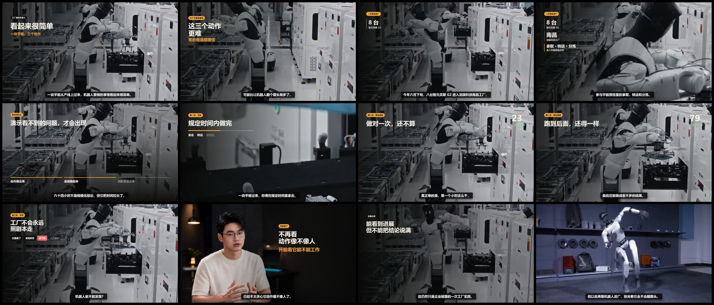
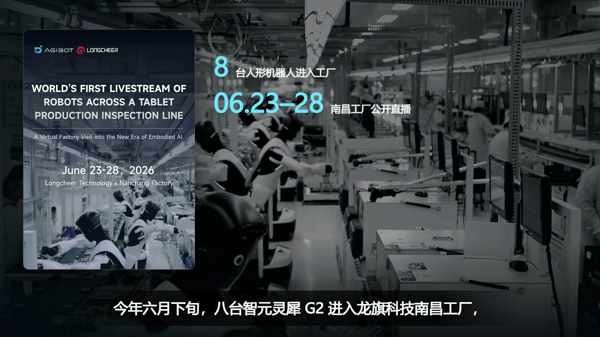

# CreatorFlow 实战：从一个选题，到一条通过人工验收的视频

CreatorFlow 不是视频生成模型，也不是输入一句话就能完成所有工作的“一键成片”按钮。它是一套由 Agent 驱动的视频生产工作流，数字人、TTS 和素材搜索都是它按需调用的能力。

下面是一条用 CreatorFlow 制作的成片。它是一条 91.6 秒横版视频，自动 QA 与人工视觉复核均已通过。准确状态是：已完成发布交接，待人工发布。

[观看 91.6 秒机器人工厂成片（MP4，约 20 MB）](assets/robot-factory-showcase-preview.mp4)

仓库提供的是 1280 × 720 预览版；案例原始成片为 1920 × 1080。

- 分辨率：1920 × 1080 横版
- 字幕：37 条
- 自动 QA 抽帧：63 帧，通过检查
- 人工视觉复核：通过，绑定成片 SHA256
- 状态：`pending_manual_publish`，已完成发布交接，待人工发布

你第一次使用时，不需要复刻这条视频，也不需要马上配置数字人。先让 CreatorFlow 认识你的账号，再完成第一个选题和脚本。

两条阅读路线：

- 完全小白：先看开篇结果和「先把 AIGC 说清楚」，再跳到「小白怎么开始」，首跑只做到 Topic + Script。
- 已会用 Agent：顺着「它到底是什么 → AIGC → 路线图 → 机器人案例 → 两种 AI 视频概念」往下读，再按需要回看入门指令。

---

## 它到底是什么

CreatorFlow 交付的不是一次生成结果，而是一条可以反复运行的生产链路：选题、判断、写作、素材、声音、剪辑、质检和发布准备。每一次运行都会在项目目录里留下可复查的文件——选题决策、锁定脚本、音频和字幕、素材来源记录、组装工程、QA 报告和人工复核记录。

数字人可以换成真人口播，TTS（Text-to-Speech，文字转语音）可以换成真人录音，素材也可以使用用户已有的视频。CreatorFlow 管的是过程，不绑定某一种生成方式。它不替你决定选题方向，不替你判断素材对错，也不替你按下发布键。

听到“AI 视频成片”就想到一句话生成一条视频，是这个产品最常见的误解。CreatorFlow 的成片来自十几条可追踪的决定：题目为什么做、脚本是否能说、素材是否有权使用、画面是否承接内容、成片有没有被人看过。每一步都可以中断、返工和续接。

---

## 先把 AIGC 说清楚

“AI 生视频属于 AIGC”，这句话本身没有错。问题出在很多人把三个不同的概念混成了一个：只要最后拿到的是视频，就以为整条视频一定是某个模型从头到尾生成的。

先看三个问题：

| 问题 | 对应概念 | 说人话解释 |
| --- | --- | --- |
| 哪些内容是生成式 AI 新产生的？ | AIGC | 可能是文字、声音、图片、视频片段或数字人画面 |
| 一条视频怎样从选题走到可发布？ | 工作流 | 谁先做什么，缺什么工具，在哪一步确认，出错后退回哪里 |
| 人还负责什么？ | 人机协作 | 选题取舍、事实判断、版权边界、审美、验收和发布责任 |

AIGC 说的是**内容从哪里来**，CreatorFlow 管的是**生产过程怎么走**。两者不是互相排斥的关系。

这条机器人视频就是混合生产：口播声音由本地 TTS 生成，开场、过渡和结尾的数字人属于 AIGC；主体使用真实工厂视频和公开页面，剪辑、证据边界、关键帧验收与发布决定也没有交给生成模型。它可以准确地称为“有 AIGC 环节的 AI 辅助视频生产”，但不能说成“一句话生成了整条视频”。

判断一条视频时，不要只问“是不是 AI 做的”，而要继续问：

1. 哪些画面和声音是生成的，哪些来自真实素材；
2. 事实依据从哪里来，生成内容有没有被当成事实证据；
3. 谁做了取舍和验收，出了问题谁负责；
4. 中间产物能不能检查和返工。

一句话概括：**AIGC 回答“哪些内容由生成式 AI 产生”，CreatorFlow 回答“一条视频怎样从选题走到可发布”。**

---

## 工作流路线图


图中主线负责生产，用户判断线在关键点交汇，按需依赖线只处理当前缺的工具，证据与返工线负责留痕和退回。

| 阶段 | 系统负责什么 | 用户决定什么 |
| --- | --- | --- |
| Topic | 搜集并评分选题 | 做不做 |
| Script | 研究、核实、形成脚本 | 观点和表达 |
| Assets | 搜索或生成素材 | 是否接受依赖 |
| Voice | 真人录音或 TTS | 声音方案 |
| Edit | 组织画面、字幕和节奏 | 审美取舍 |
| QA | 技术检查和人工复核 | 是否收尾发布 |

---

## 机器人案例：从选题到交接

这条 91.6 秒视频不是临时拼出来的展示片。它从三个备选题开始，经过人工锁题、口播锁定、素材筛选、数字人接入、组装和两层 QA，最后才进入发布交接。数字人出现在开场和结尾，只是这条成片选择的表达方式，不是入门门槛。

下面先看关键帧总览，再按四个阶段拆开。



这 12 张关键帧按时间排列：视频以数字人开场，切入真实工厂素材，用证据卡片和终判收束。

### 1. 选题评分：三个角度，先比再锁

系统没有只给一个题，而是把同一事件拆成三个角度：

1. 怎么看机器人进厂
2. “64 小时”证明了什么
3. 从演示到产线要看哪四件事

最终锁定的 A 题得分 32 / 35。原因很具体：问题最清楚，观众能直接带走三项判断——能不能跟上生产节拍，能不能长时间稳定重复，出了问题还要不要人接手。选题由使用者用自然语言确认，系统没有替人拍板。

### 2. 口播锁定：先定说什么，再让音频决定画幅

口播确认后才进入 TTS。真实音频约 91.5 秒，共 37 条字幕，因此项目选择 1920 × 1080 横版，并按实际时间轴拆成 13 个逐句视觉任务。先锁内容，再决定画幅和节奏，避免“先做画面、再硬塞台词”。

### 3. 素材与数字人：真实画面做主体，数字人只负责开合

素材阶段通过 Agent Reach 找到涉事公司的公开页面和官方工厂视频，再把来源绑定到具体台词。企业公布的“64 小时”等数据保留“企业官方回顾称”的边界；官方公开视频可以用来核对事件和寻找画面，但不自动等于已经取得商用授权。

数字人只出现在开场、过渡和结尾，总出镜约 15.7 秒。真实工厂画面与解释动效承担主体：人物抛题，真实素材证明，动效连接动作和判断。异常处理没有伪造事故画面，而是用真实工厂底片加明确标注的演示示意。


第 1 秒：数字人开场，画面切入机器人工厂产线，数字人与真实素材并排呈现。



约第 20 秒：证据卡片展示运行数据，包括机器人数、运行时长和日期范围，信息有独立阅读窗口。

### 4. 自动 QA 与人工验收：脚本 PASS 还不够

自动 QA 导出 63 张复核帧并报告 PASS，人工复核仍继续检查首帧、字幕、证据卡片、空媒体位、转场和结尾。过程中发现并修复了约 12 秒附近的黑帧，也去掉了多余的内部标签。最终人工验收绑定到成片 SHA256。

当前状态是 `pending_manual_publish`：已完成发布交接，待人工发布。系统没有替用户自动上传平台。


约第 90 秒：数字人完成判断后收束——看它能不能上班。

---

## 别把视频生成模型和视频生产工作流混在一起

有人看到这条 91.6 秒成片，第一反应是：“AI 生成一分钟视频要多少钱？”这句话已经把两个层级混在了一起：他以为整条视频都像 Seedance 那样，由生成式视频模型一秒一秒生成出来。

其实，一个是**生成内容的模型能力**，一个是**组织整条视频的生产流程**。

| 对比 | 视频生成模型，例如 Seedance | Agent 视频生产工作流，例如 CreatorFlow |
| --- | --- | --- |
| 它主要做什么 | 根据提示词、图片或参考视频生成新镜头 | 把选题、资料、脚本、素材、声音、剪辑和验收串起来 |
| 典型输出 | 一段生成式视频素材 | 一条有来源记录和验收过程的完整成片 |
| 真实素材的位置 | 可以不用真实素材 | 可以让真实素材成为主体 |
| AIGC 的位置 | 生成画面就是核心能力 | 需要时用于脚本、TTS、数字人或个别镜头 |
| 人还要负责什么 | 选择提示词和生成结果 | 判断事实、版权、表达、审美，并完成最终验收 |

可以把 Seedance 理解成片场里一台“生成镜头的机器”，CreatorFlow 更像整套制片流程。它决定这条视频讲什么、证据从哪里来、哪些地方用真实素材、哪些地方调用 AI、最后怎样剪出来并交给人验收。两者不是互相替代的关系：CreatorFlow 需要某个生成镜头时，也可以把视频生成模型接进来。

这条机器人视频就没有让模型从头生成 91.6 秒画面。主体是通过 Agent Reach 找到并核实的真实工厂素材；本地 TTS 负责口播；数字人负责开场、过渡和结尾；之后再完成剪辑、自动 QA 和人工验收。这里的 91.6 秒是**最终成片时长**，不是“生成式视频模型生成了 91.6 秒”。

所以，听到“一分钟多少钱”时，先别急着报数字。先问清楚：这一分钟是要从零生成画面，还是把真实素材组织成片？生成式镜头占多少？要不要找资料、核实事实、配音、剪辑和质检？这些问题不说清楚，大家口中的“AI 做视频”说的根本不是同一件事。

---

## 小白怎么开始

### 1. 最低门槛

你不需要会写代码，也不需要先懂 Git。CreatorFlow V1 在 Windows 上运行，它不是一个双击安装的软件，而是一套放在本地文件夹里、交给具备文件和终端能力的 Agent 去执行的工作流。

第一次只要做到三件事：下载并解压 ZIP、用 Agent 打开文件夹、复制一段提示词。遇到安装请求时，你只需要决定同意或不同意。

### 2. 先记住三个词

- Agent 工具：能读写本地文件、能跑终端命令的助手，例如 TRAE Work、Codex、Claude Code、OpenClaw 或 Hermes。
- CreatorFlow：六个阶段的视频生产工作流，不是一键成片按钮。
- 个人四配置：`account-profile.md`、`writing-style.md`、`knowledge-sources.md`、`source-content.md`。它们决定账号为谁服务、怎么说话、相信哪些来源、这次做什么题。

### 3. 不用 Git，先用 ZIP

1. 打开 [CreatorFlow 公开仓库](https://github.com/Damonhhh/creator-flow)。
2. 点击 `Code` → `Download ZIP`，下载后解压到一个可写的本地目录。
3. 用你的 Agent 工具打开解压后的根文件夹。
4. 确认这个文件夹里能看到 `README.md`、`scripts`、`.agents` 和 `examples`。看到这些文件，才说明打开的是仓库根目录。

如果手里有课程发放的固定 ZIP，优先用课程包；公开仓库适合后续查看更新。

### 4. 完整首条指令

打开仓库根目录后，直接把下面这段发给 Agent。创建项目和填写四份个人配置也交给它带着你完成：

```text
请使用 CreatorFlow 的 zimeiti-video-workflow。
先只做 Core 能力检查，把缺失项、用途、官方下载来源、准备执行的命令和风险列给我；未经我明确同意，不要下载、安装、登录或写入凭据。
Core 返回 ready: true 后，用仓库模板在 videos 目录创建一个名为 my-first-video 的新项目。不要让我手动执行命令。
接着逐项向我提问，帮助我填写 account-profile.md、writing-style.md、knowledge-sources.md、source-content.md。我回答“不确定”时，请给我两到三个具体选项，不要替我编造经历、观点或知识来源。
四份文件经我确认后，从 Topic 阶段开始，给出候选选题、评分、风险和淘汰理由。我确认题目后，再生成一份可复查的脚本草稿。
第一次运行到脚本草稿就停下，不执行 TTS，不进入 Material、Assembly、QA 或 Publish，也不要把 Script TTS 标记为已经完成。
以后需要安装依赖时，仍然要先说明用途、官方来源、准备执行的命令、风险和不安装时的替代方案，得到我的明确同意后再执行。
```

### 5. 系统会问你什么

第一次跑通时，Agent 会先问清你的内容基础：

- 账号准备发在哪个平台，主要给谁看；
- 你长期想讲什么，明确不碰什么；
- 你喜欢怎样说话，有没有自己写过的文字可作参考；
- 哪些资料来源可以信，哪些私人内容不能公开；
- 这次已经有题目、文章、资料或素材，还是需要它先给候选题。

这些问题不需要一次答得很专业。不会回答时，直接说“我不确定，请给我两到三个选项”，再挑最接近自己的一个。四份配置确认后，Agent 才进入 Topic，随后请你选择候选题，并确认脚本的观点、边界和表达。

Core 检查只确认 PowerShell、Python、FFmpeg 和 ffprobe。TTS、素材搜索、渲染器和数字人要到后续阶段才会询问是否接入。

数字人不是入门必选项。没有数字人，也可以先用真人口播、已有音频，或暂时停在脚本。

### 6. 新手首跑只到 Script

新手第一次成功的标准，是把自己的内容交给工作流，并得到一份有依据的脚本草稿：

1. Agent 读懂你的账号定位；
2. Topic 给出候选选题和评分；
3. 你确认后，项目里留下一份可复查的脚本草稿；
4. 明确停住，不继续往下冲。

素材、声音、剪辑、QA、发布都留到第二次以后。

### 7. 成功标志

看到下面这些结果，就可以判定第一次入门成功：

- Core 检查返回可用，或缺失项已被清楚列出且尚未擅自安装；
- 项目目录里能找到四份个人配置；
- 有选题结论 / 评分，不只是一句“这个题不错”；
- 有可复查的脚本草稿，并且没有把尚未完成的 Script TTS 写成完成；
- Agent 没有自行执行 TTS，也没有进入 Material、Assembly、QA 或 Publish。

### 8. 最小故障区

卡住时按下面四种情况处理：

1. **Agent 说找不到 CreatorFlow**：重新打开同时包含 `README.md`、`scripts`、`.agents` 和 `examples` 的根目录，不要只打开 ZIP、子文件夹或临时预览目录。
2. **Agent 不能读写文件或运行命令**：确认当前使用的是支持本地文件和终端的 Code Mode；只有普通聊天能力的平台无法运行完整链路。
3. **Core 返回 `ready: false`**：让 Agent 逐项列出缺少的 PowerShell、Python、FFmpeg 或 ffprobe，并提供官方来源、拟执行命令和风险。确认前不要粘贴来历不明的安装命令。
4. **没有 TTS、数字人或素材工具**：先停在脚本草稿完全没问题。后续可以选择真人录音、自带素材或其他渲染器，不需要为了入门一次装齐全部工具。

中途关闭 Agent 也不用重来。重新打开仓库，让它读取 `videos\my-first-video\project-state.json` 和现有文件，先汇报当前状态，再从未完成的位置继续。

[打开 CreatorFlow 公开仓库](https://github.com/Damonhhh/creator-flow)

---

> **依赖与隐私**
> CreatorFlow 不会默认替用户安装所有工具。运行到 TTS、素材搜索、数字人或剪辑阶段时，如果缺少能力，会先说明需要什么、为什么需要、从哪里获取，再询问是否安装。账号、密钥、Cookie、本机路径和私人知识库不会进入公开模板。
