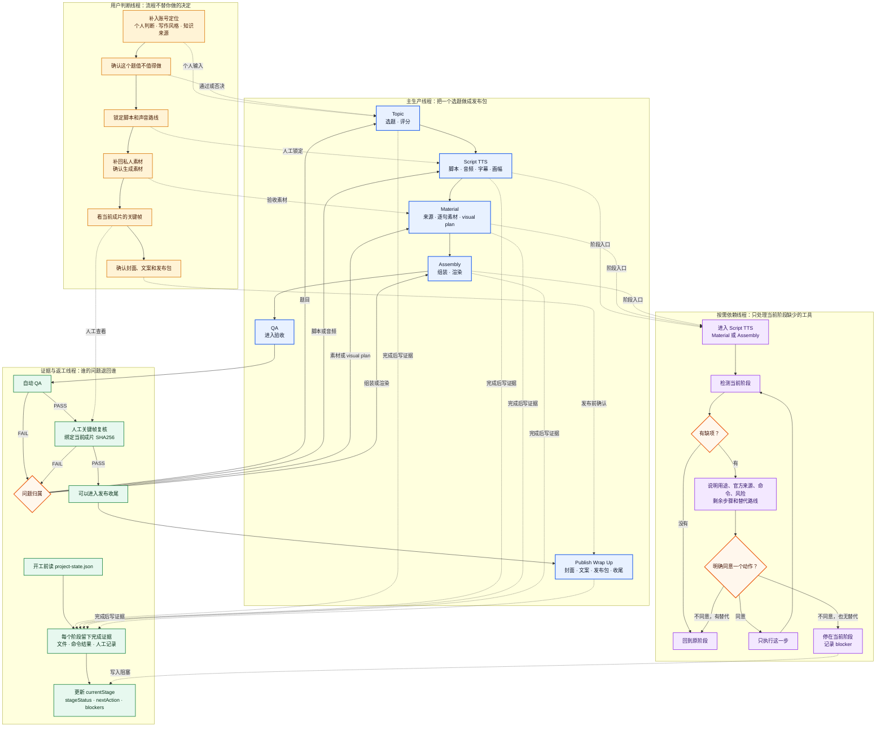

# CreatorFlow 工作流线程图

这张图把 CreatorFlow 里同时运行的几条线放在一起：视频往前做，用户在关键点做判断，外部工具按需接入，QA 发现问题后退回真正负责的阶段。

下面的 Mermaid 版本保留了完整节点和连接关系，适合继续修改或核对细节。

## 怎么读这张图

- 主线只负责生产。一个阶段没有文件、命令结果或人工验收记录，就不算完成。
- 用户判断线会在关键点和主线交汇。CreatorFlow 可以整理选项、执行和检查，但账号定位、内容判断、私人声音和发布决定仍然归使用者。
- 依赖线是旁路。安装 Agent Reach、IndexTTS2 或 HyperFrames 只会解决当前工具缺口，不会自动把生产状态推进到下一阶段。一次 `-AcceptAction` 只授权一个准确动作。
- QA 包含两道门：自动检查和人工关键帧复核。任意一道失败，都要退回题目、脚本、素材或组装的真正责任阶段。

## 六个阶段各自交什么

| 阶段 | 开工条件 | 主要交付 | 进入下一阶段前 |
| --- | --- | --- | --- |
| Topic | 用户想法、信号或来源线索 | 选题结论、评分、风险和证据 | 人能用一句话说清观众会带走什么 |
| Script TTS | 已通过的选题 | 锁定脚本、实际音频、SRT 和画幅决定 | 脚本、音频和字幕时间一致 |
| Material | 锁定脚本和方向 | 来源候选、逐句视觉任务、本地素材和 visual plan | 每个句子有可执行的视觉任务，缺口已补齐或明确免除 |
| Assembly | 素材和 visual plan 已完成 | 可检查的组装工程和候选成片 | 工程检查通过，每个视觉任务在成片中真正出现 |
| QA | 候选成片和项目证据 | 自动 QA 报告、关键帧和绑定成片 SHA256 的人工复核 | 自动 QA 和人工复核都通过 |
| Publish Wrap Up | 已验收成片 | 成片、封面、发布文案、`publish\` 包和收尾状态 | 确认最终路径、跳过的动作和同步结果 |

更细的输入、输出、检查命令和失败返回规则，见[六阶段执行图](../.agents/skills/zimeiti-video-workflow/references/pipeline.md)。
